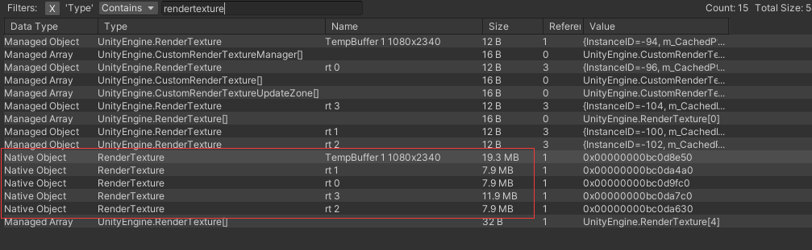
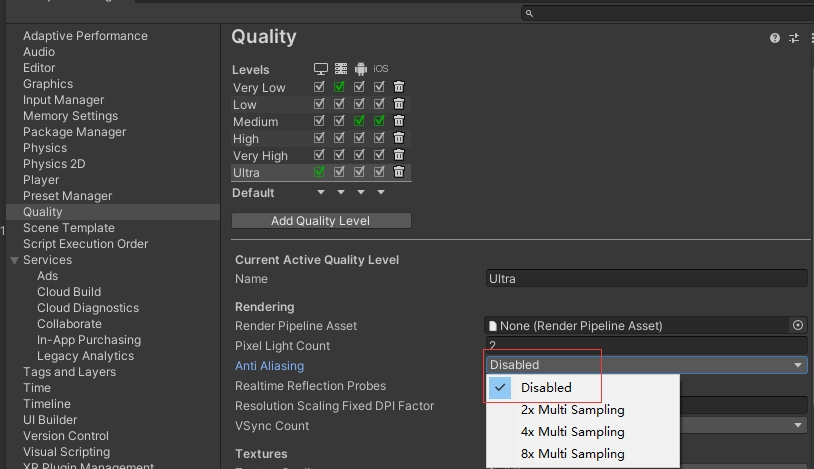

## RenderTexture
### OnRenderImage
实现了OnRenderImage方法，会增加一份名为 "TempBuffer 1 1080x2340"（数字是手机分辨率） 的缓存文件。[（官方描述：internally, Unity creates one or more temporary RenderTextures to store these intermediate results.）](https://docs.unity.cn/cn/current/ScriptReference/MonoBehaviour.OnRenderImage.html)

### RenderTexture.GetTemporary()
如果通过RenderTexture.GetTemporary()获取的rt，rt名默认也是 "TempBuffer 1 1080x1920"  (数字是rt尺寸)  
为了识别未释放rt，debug模式下建议给rt取个名字 
RenderTexture 用完一定要Release 

通过RenderTexture.GetTemporary()获取的调用RenderTexture.ReleaseTemporary(rt);  
 
在内部，Unity 保留一个临时渲染纹理池， 因此调用 GetTemporary 通常只是直接返回一个已创建的渲染纹理（如果大小和格式匹配）。 如果若干帧都不使用这些临时渲染纹理，才将它们实际销毁。 
所以，如果频繁调用的地步建议使用RenderTexture.GetTemporary()接口

### new RenderTexture()
直接new的RT实力名字默认为空，debug模式下建议给rt取个名字，方便辨识  
new出来的用 rt.Release();释放 

### 抗锯齿
开启msaa 会多一个Camera.ImageEffects的drawcall，也会多一张全屏的RT

